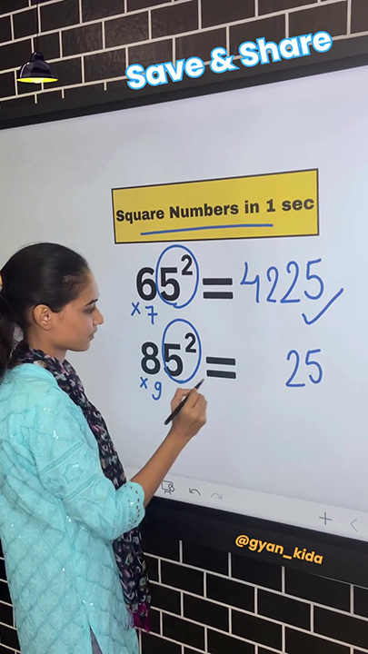

# Square tester

I saw an [Instagram video](https://www.instagram.com/reel/C01NZ4dPT82/) that showed a trick to quickly calculate the square of a number... As a maths teacher, my Spider sense was tingling, so I wanted to write a program to test every number in a range and check if it followed the rule shown in the video.

Spoiler alert: it only works for numbers ending in '5', but hey... You could have guessed that from watching the video!
